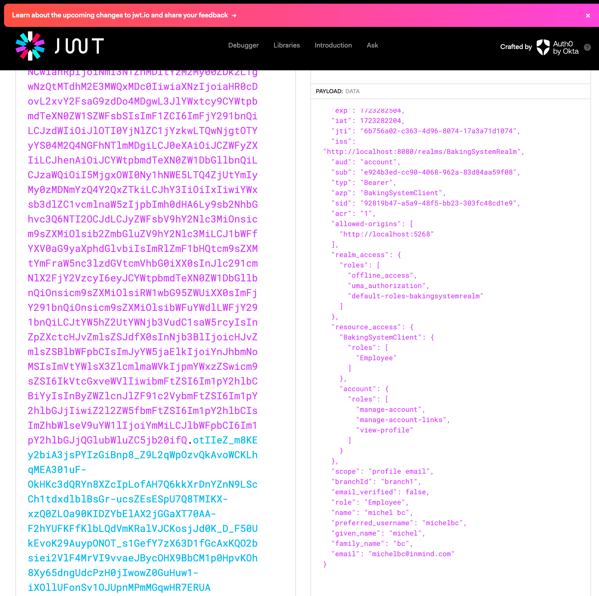

# Project: Banking System API
## Objective
Build a full API using all the knowledge acquired during this module

## Introduction
Build a Baking System API while taking the following into consideration:

- The system is used across different branches
  - Each branch can see only their data
  
- An employee can create accounts for a customer
  - A customer can have a maximum of 5 accounts across all branches.
  - A customer can add a transaction to one of his accounts:
    - Transactions can be a withdrawal or a deposit
    - An employee can add a recurrent transaction and link it to a client account.

- The following user roles are available:
  - Admin
    - An admin has full access to all data.
      
  - Employee
    - An employee has write access to the branch where he’s employed.
    - An employee has only read access to other branches' data.
      
  - Customer
    - A Customer only has access to
    - Read his accounts (can’t create a new account).
    - Create/read transactions.
      
- Extra
Include event sourcing allowing the admin to roll back the transactions of a specific day. He should be able to roll
back all the database transactions or filter for specific transactions of a specific account.

### Links:

admin: http://localhost:8080/admin/master/console/#/BakingSystemRealm/

user: http://localhost:8080/realms/BakingSystemRealm/protocol/openid-connect/auth?client_id=account-console&redirect_uri=http%3A%2F%2Flocalhost%3A8080%2Frealms%2FBakingSystemRealm%2Faccount&state=edad8647-844d-46e3-8aca-247d01aead01&response_mode=query&response_type=code&scope=openid&nonce=c1f3bd39-effc-4ea6-b305-387331ea75d5&code_challenge=rtdl02sh5YM49Oiip94_EOVOnqdQBWU987nx08sRJug&code_challenge_method=S256

# Solution

## NB:
Taking into consideration that in an organization the IT/admin creates a user account for an employee... ---in progress

## keycloak configuration:
- added role and branchId in jwt token
  - branchId is an attribute user input at signup (he will register to a specific branch of the bank)
  - role is also assigned to the user at signup

## dbContext and database:
dotnet ef dbcontext scaffold "Host=localhost;Database=bankingsystemdb;Username=postgres;Password=<pass>" Npgsql.EntityFrameworkCore.PostgreSQL -o Models -c BankingSystemContext 
#### I want to check the tenant ID only on application startup and not on every request:
steps:
 - Initializing Tenant Information at Startup: During application startup, we
retrieve the tenant information from the database and store it in a static or singleton service. 
This approach avoids querying the database on every request.

 - Using a Singleton Service: Created a singleton service that holds the tenant information. (ITenantService)
This service can be injected into your DbContext and used to set the schema for each request.

- BankingSystemContextFactory is implmented with a mock service only to apply some migrations.

## Requirements and Banking System
  1- employee creates account for customer -> max 5 on all branches for 1 customer ---finished

- get all customers in the branch of the logged in employee --done
- get all accounts for a specific customer in the branch of the employee logged in (and across all branches) --done
- create account for customer in any branch of the bank (ex: customer in branch A go to employee in branch A => can create account for this customer in branch A and all others) --done
- NB: Customer that have accounts registered in branches other than there initial one will be added to the db of the new branch where the account is present (foe account reference)

  2- A customer can add a transaction to one of his accounts: Transactions can be a withdrawal or a deposit

  3- An employee can add a recurrent transaction and link it to a client account.

# Michel Bou Chahine
## inmind.ai