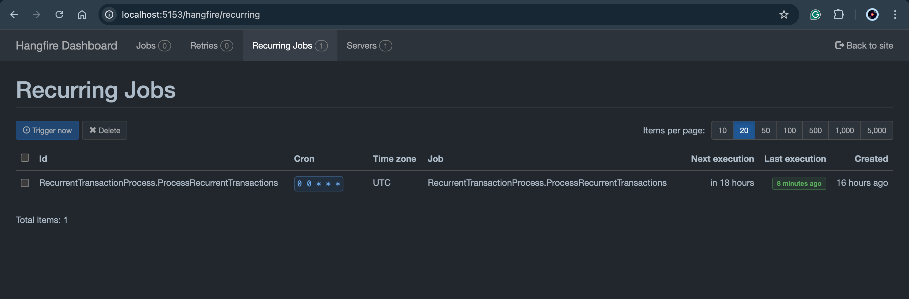

# Project: Banking System API
## Objective
Build a full API using all the knowledge acquired during this module

## Introduction
Build a Baking System API while taking the following into consideration:

- The system is used across different branches
  - Each branch can see only their data
  
- An employee can create accounts for a customer
  - A customer can have a maximum of 5 accounts across all branches.
  - A customer can add a transaction to one of his accounts:
    - Transactions can be a withdrawal or a deposit
    - An employee can add a recurrent transaction and link it to a client account.

- The following user roles are available:
  - Admin
    - An admin has full access to all data.
      
  - Employee
    - An employee has write access to the branch where he’s employed.
    - An employee has only read access to other branches' data.
      
  - Customer
    - A Customer only has access to
    - Read his accounts (can’t create a new account).
    - Create/read transactions.
      
- Extra
Include event sourcing allowing the admin to roll back the transactions of a specific day. He should be able to roll
back all the database transactions or filter for specific transactions of a specific account.

### Links:

admin: http://localhost:8080/admin/master/console/#/BakingSystemRealm/

user: http://localhost:8080/realms/BakingSystemRealm/protocol/openid-connect/auth?client_id=account-console&redirect_uri=http%3A%2F%2Flocalhost%3A8080%2Frealms%2FBakingSystemRealm%2Faccount&state=edad8647-844d-46e3-8aca-247d01aead01&response_mode=query&response_type=code&scope=openid&nonce=c1f3bd39-effc-4ea6-b305-387331ea75d5&code_challenge=rtdl02sh5YM49Oiip94_EOVOnqdQBWU987nx08sRJug&code_challenge_method=S256

# Solution

## NB:
Taking into consideration that in an organization the IT/admin creates a user account for an employee... ---in progress

## keycloak configuration:
- added role and branchId in jwt token
  - branchId is an attribute user input at signup (he will register to a specific branch of the bank)
  - role is also assigned to the user at signup

## dbContext and database:
dotnet ef dbcontext scaffold "Host=localhost;Database=bankingsystemdb;Username=postgres;Password=<pass>" Npgsql.EntityFrameworkCore.PostgreSQL -o Models -c BankingSystemContext 
#### I want to check the tenant ID only on application startup and not on every request:
steps:
 - Initializing Tenant Information at Startup: During application startup, we
retrieve the tenant information from the database and store it in a static or singleton service. 
This approach avoids querying the database on every request.

 - Using a Singleton Service: Created a singleton service that holds the tenant information. (ITenantService)
This service can be injected into your DbContext and used to set the schema for each request.

- BankingSystemContextFactory is implmented with a mock service only to apply some migrations.

## Requirements and Banking System
  1- employee creates account for customer -> max 5 on all branches for 1 customer ---finished

- get all customers in the branch of the logged in employee --done
- get all accounts for a specific customer in the branch of the employee logged in (and across all branches) --done
- create account for customer in any branch of the bank (ex: customer in branch A go to employee in branch A => can create account for this customer in branch A and all others) --done
- NB: Customer that have accounts registered in branches other than there initial one will be added to the db of the new branch where the account is present (foe account reference)

  2- A customer can add a transaction to one of his accounts: Transactions can be a withdrawal or a deposit --finished

- this implementation involves a customer to log in --done
- customer can deposit or withdrawal to any of HIS accounts on ANY BRANCH even not his initial one (case of ATM in any branch of the bank) --done
#### - NB Added FEATURE: Customer can TRANSFER Amount from his accounts to another on any branch ---IN Progress

  3- An employee can add a recurrent transaction and link it to a client account.

- for this section I'll be creating an independent microservice for better scalability and resilience (ability to recover from failures and continue operating)
## I'll be using RabbitMQ for these reasons:
- When an employee adds a recurrent transaction, the main API sends a message to RabbitMQ. 
The recurrent transaction microservice then consumes this message and processes it independently. 
If the microservice is down, the message stays in RabbitMQ until the service is back online. 
This setup is resilient and scales well because both services can operate and scale independently.

- Using grpc will cause some problems; if the microservice is down, the request fails immediately, 
potentially causing issues in the system.

In the main API => employee will create a recurrent transaction for a customer account (the account specified could be on any branch of the bank) --done

This recurrent transaction will be queued to the microservice, added to its database and will update the recurrent transaction when it's time.
The system will DAILY check to execute recurrent transactions --Done

### Recurrent transaction workflow:
- when employee adds recurrent transaction for a customers account (any branch where account is placed) this will be added to branch recurrent transaction table as well it will be queued
to the microservice and added to its DB
- the microservice will execute a daily background job to check for recurrent transactions updates, if any => these updated will be sent to the main api to update the recurrent transactions table 
as well update the account (Withdrawal or Deposit)

### User Role and Access:

Since roles are added to the JWT token, we just add a filter speciying the role that has access to a the specific endpoint that we want --Finished

- admin can view and edit all data
- employees can view all data but only create and edit data on there branch
- customer can view there accounts and create transactions (deposit/withdrawal)

// add endpoint to view Transactions

### Extra:

- admin can rollback transactions by entering the accountid, branchid and the date of which the transactions where made.
#### logic WorkFlow:
- search for the account
- search for transactions for the account in the date specified
- execute the opposite on the account (if deposit 50 => withdrawal 50 and vice versa)
- delete transactions from db

## Health Check:
- Microsoft.Extensions.Diagnostics.HealthChecks
- AspNetCore.HealthChecks.Npgsql
- AspNetCore.HealthChecks.Network
- AspNetCore.HealthChecks.UI
- AspNetCore.HealthChecks.UI.InMemory.Storage
- AspNetCore.HealthChecks.UI.Client
- AspNetCore.HealthChecks.UI.Data
- AspNetCore.HealthChecks.UI.Core
- AspNetCore.HealthChecks.Uris

### Serilog : logging to mongodb:
packages:
- Serilog.AspNetCore
- Serilog.Sinks.MongoDB

# Michel Bou Chahine
## inmind.ai